  

## 👋 About Me

~~~yaml
name: Jash Khatri
role: B.Tech Computer Engineering Student

interests:
  - Artificial Intelligence & Machine Learning
  - Software Development
  - Cybersecurity
  - Game Development

currently_learning:
  - AI Agents
  - Machine Learning
  - Cloud Computing

languages:
  - Java
  - C++
  - Python
  - C#
  - SQL

fun_fact: I enjoy anime, games, and building things with code 🎮
~~~

## 🧰 Tools & Technologies

  
  
  
  
  
  
  
  
  
  
  
  
  
  

## 🚀 Projects

### 🛡️ Federated GRU-Based IoT Intrusion Detection System

Federated learning based intrusion detection system for IoT environments using GRU models.

**Technologies:** Python, TensorFlow, Keras, Flower, MQTT, Zeek, Suricata, VirtualBox

### 🤖 AI-Powered Conversational Invoicing Assistant

- Built an LLM-powered invoicing assistant using **Groq and Llama 3.3 70B** to extract invoice details from emails.
- Integrated **Gmail and Zoho Invoice APIs** to automate invoice creation, delivery, and payment tracking.
- Developed a **FastAPI and PostgreSQL** backend with shared web and Telegram interfaces.

### 🔐 Cryptographic Wipe Tool Using Bootable ISO

- Built a cryptographic data-destruction tool using **Rust and LUKS2** encryption for secure storage sanitization.
- Implemented **AES-256-XTS** full-disk wiping with an interactive command-line workflow.
- Packaged the solution as a **bootable image supporting BIOS and UEFI** systems.

### 🎮 Game Development

Game development projects involving gameplay systems, dialogue systems, and inventory systems.

**Technologies:** Godot, GDScript, Lua

## 📊 GitHub Stats

  
  

## 🐍 Contribution Snake

  <picture>
    <source
      media="(prefers-color-scheme: dark)"
      srcset="https://raw.githubusercontent.com/Frostwave-afk/Frostwave-afk/output/github-contribution-grid-snake-dark.svg"
    />
    <source
      media="(prefers-color-scheme: light)"
      srcset="https://raw.githubusercontent.com/Frostwave-afk/Frostwave-afk/output/github-contribution-grid-snake.svg"
    />
    
  </picture>

## 🔗 Connect With Me

  

  

